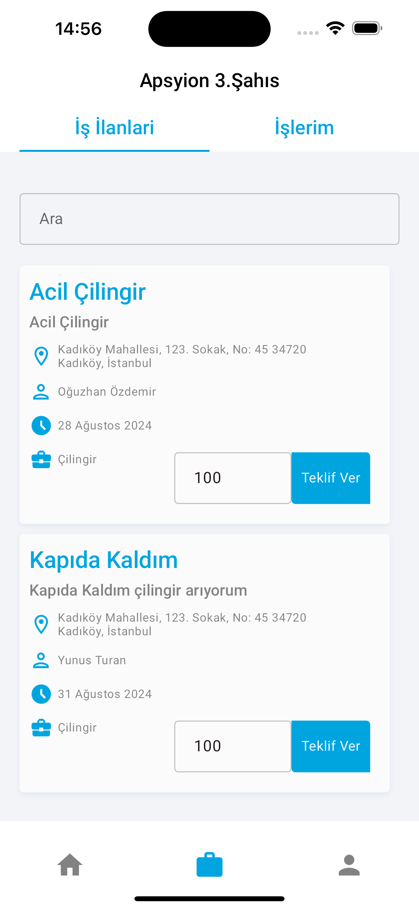

## Overview

The **Site Management** project, developed by Yunus Turan and Oğuzhan Özdemir, aims to enhance property management processes. The project includes three separate mobile applications targeting different user groups, with the goal of facilitating the management of residential and commercial real estate.

## Mobile Applications

### 1. Site Management User App

- **User-Centric Features:**
    - Users can track their personal calendars.
    - Create and manage new posts.
    - Participate in meetings.
- **Advanced Communication:**
    - The app fosters community by enhancing communication among residents.
- **Service Requests:**
    - Users can easily submit service requests and track their status.
 
    

         
         
                  
                                    

   

### 2. Site Management Admin App

- **Admin Panel:**
    - Provides facility managers with tools to organize schedules and meetings.
- **Data Analysis:**
    - Helps analyze property management data for better decision-making.
- **User Management:**
    - Administrators can manage user access permissions and track system changes.
 
   
      

### 3. Site Management Third-Party App

- **Service Providers:**
    - External service providers can create listings, respond to service requests from users, and manage their tokens through the app.
- **Job Applications:**
    - Users can apply for different jobs and explore new opportunities.
- **Token System:**
    - The app offers a secure token-based payment and exchange system.
 
   
                  
                                    
                                                                        

## Technical Specifications

- **Technologies Used:**
    - Flutter
    - Firebase
    - ZegoCloud
